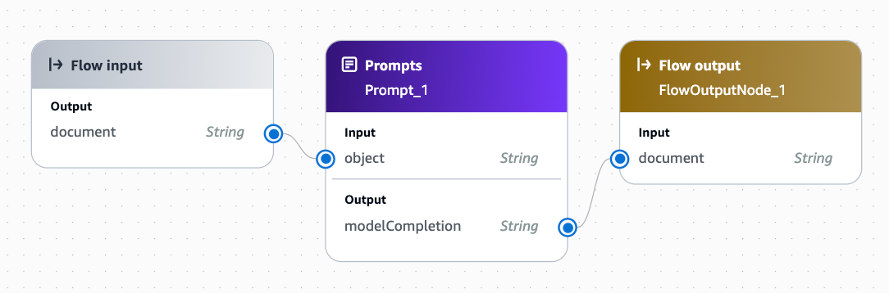

# 🌈 Color Oracle: AI-Powered Object Color Identifier


## 🚀 About The Project

Color Oracle is an innovative application that harnesses the power of AWS Bedrock's Prompt flow to answer the seemingly simple yet intriguing question: "What color is this object?" This project demonstrates the fascinating intersection of artificial intelligence and color perception.

## 🛠️ Built With

- [Deno](https://deno.land/) - A modern runtime for JavaScript and TypeScript
- [AWS Bedrock](https://aws.amazon.com/bedrock/) - A fully managed service for building AI applications with foundation models

## 🏁 Getting Started

### Prerequisites

- [Deno](https://deno.land/) - A modern runtime for JavaScript and TypeScript
- [AWS Bedrock](https://aws.amazon.com/bedrock/) - A fully managed service for building AI applications with foundation models

### Installation

1. Clone the repo
```sh 
   git clone https://github.com/LibertySource/color-oracle.git
```

2. Navigate to the project directory

```sh
   cd color-oracle
```

3. Set up your AWS credentials (refer to AWS documentation)

4. Create an AWS Prompt similiar to the following

```txt
You will be provided the name of an object. Your task is to simply state what color that object is. Do not give any explanation, simply state one single color that best desribes the image. The object is {{object}}
```

5. Create AWS Prompt Flow to use above prompt



6. Copy .env-sample to .env and populate values 

## 🖥️ Usage

Run the application using Deno:  

```sh
deno task start
```

Follow the prompts to input an object, and watch as the AI determines its color!

## 🌟 Features

- 🤖 Utilizes advanced AI to interpret color descriptions
- 🌐 Leverages AWS Bedrock for robust and scalable performance
- 🚀 Built on Deno for lightning-fast execution

## 🤝 Contributing

Contributions are what make the open-source community such an amazing place to learn, inspire, and create. Any contributions you make are **greatly appreciated**.

1. Fork the Project
2. Create your Feature Branch (`git checkout -b feature/AmazingFeature`)
3. Commit your Changes (`git commit -m 'Add some AmazingFeature'`)
4. Push to the Branch (`git push origin feature/AmazingFeature`)
5. Open a Pull Request

## 📜 License

Distributed under the MIT License. See `LICENSE` for more information.

## 📞 Contact

Jeff Holst - jeff@libertysource.com  

Project Link: [https://github.com/LibertySource/color-oracle](https://github.com/yourusername/color-oracle)

## 🙏 Acknowledgments

- [AWS Bedrock Documentation](https://docs.aws.amazon.com/bedrock/)
- [Deno Documentation](https://deno.land/manual)
- [Choose an Open Source License](https://choosealicense.com)

---

<p align="center">Made with ❤️ and a splash of 🎨</p>